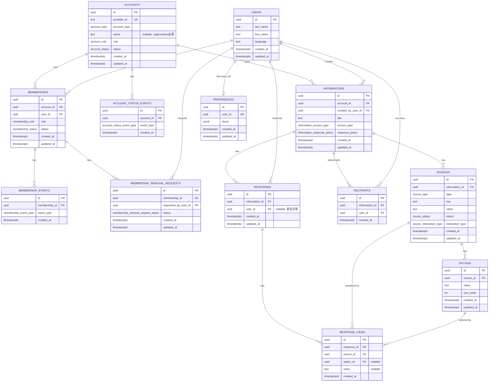

# knot

送信者が作成した情報を、AIが受信者ごとに最適化して届けるコミュニケーションプラットフォーム。

- `api`: 発信者・受信者それぞれにAIエージェントを提供するバックエンド(Go)
- `app`: フロントエンド(Next.js)

## 必要なもの

- [Go](https://go.dev/) 1.27以上
- [Bun](https://bun.sh/) 1.3以上
- [Docker](https://www.docker.com/) / Docker Compose(Postgresの起動に使う)
- Supabaseプロジェクト(認証。JWT署名鍵は非対称鍵に設定しておくこと)
- OrcaRouterのAPIキー(AI呼び出し)

## 起動手順

### 1. 環境変数ファイルを用意する

```bash
cp api/.env.example api/.env
cp app/.env.example app/.env
```

### 2. 環境変数を埋める

`api/.env` に必要な値:

| 変数名 | 値の入手先 |
|---|---|
| `ORCAROUTER_BASE_URL` / `ORCAROUTER_API_KEY` | OrcaRouterのダッシュボード |
| `AI_MODEL` | OrcaRouterで利用可能なモデルID(例: `openai/gpt-4o-mini`) |
| `PORT` | 例: `8080` |
| `GIN_MODE` | 例: `debug` |
| `POSTGRES_HOST` / `POSTGRES_USER` / `POSTGRES_PASSWORD` / `POSTGRES_DB` / `POSTGRES_PORT` | 手順3のPostgresに合わせて設定(例は下記) |
| `SUPABASE_URL` | Supabaseダッシュボード `Settings > API` のProject URL(`app/.env`の`NEXT_PUBLIC_SUPABASE_URL`と同じ値) |
| `CORS_ALLOWED_ORIGINS` | 未設定の場合`http://localhost:3000`がデフォルトで許可される |

`app/.env` に必要な値:

| 変数名 | 値の入手先 |
|---|---|
| `NEXT_PUBLIC_SUPABASE_URL` | Supabaseダッシュボード `Settings > API` のProject URL |
| `NEXT_PUBLIC_SUPABASE_ANON_KEY` | Supabaseダッシュボード `Settings > API` のanon key |
| `NEXT_PUBLIC_API_BASE_URL` | ローカルでは`http://localhost:8080`(手順4のapiに合わせる) |

### 3. Postgresを起動する

```bash
cd api
docker compose up -d db
```

`api/.env` の `POSTGRES_*` は、そのままローカル接続用に以下の値で揃えると動きます。

```bash
POSTGRES_HOST=localhost
POSTGRES_USER=knot
POSTGRES_PASSWORD=knot
POSTGRES_DB=knot_api
POSTGRES_PORT=5432
```

### 4. APIサーバーを起動する

```bash
# api ディレクトリで実行
go run ./cmd/server
```

起動時にマイグレーションが自動実行される。`http://localhost:8080` で待ち受ける。

### 5. フロントエンドを起動する

```bash
cd ../app
bun install
bun run dev
```

`http://localhost:3000` で待ち受ける。

### 6. 動作確認

ブラウザで [http://localhost:3000](http://localhost:3000) を開く。

## ER図



詳細は [`api/README.md`](./api/README.md) を参照。
