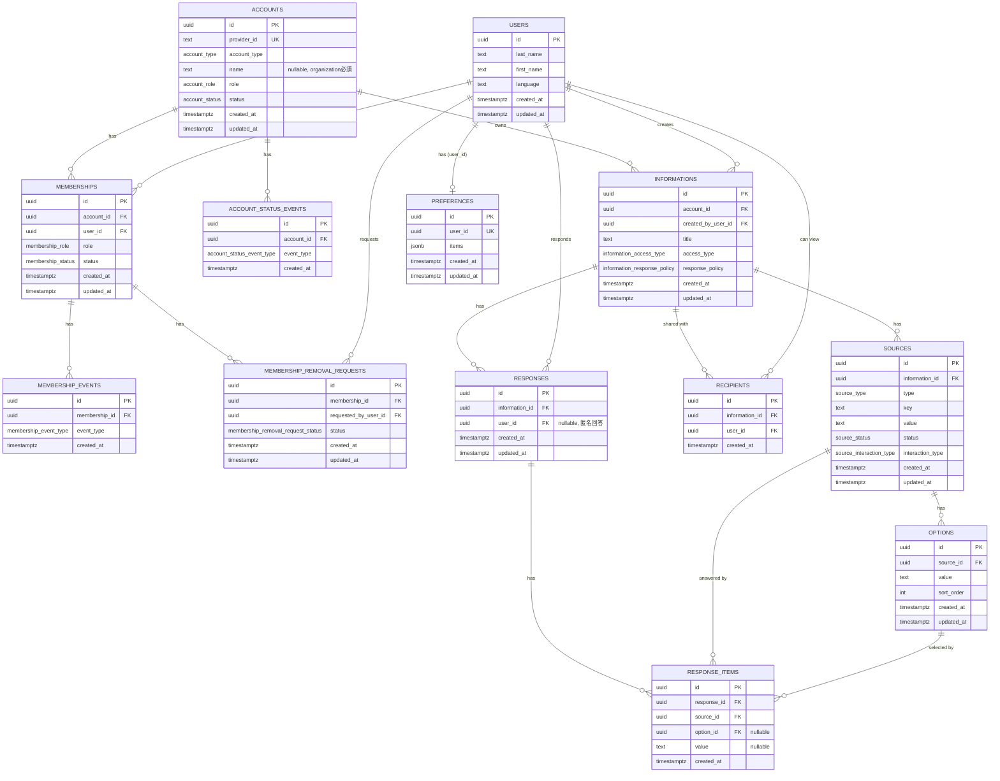

# ER図

```mermaid
erDiagram
    ACCOUNTS ||--o{ MEMBERSHIPS : has
    USERS ||--o{ MEMBERSHIPS : has
    MEMBERSHIPS ||--o{ MEMBERSHIP_EVENTS : has
    MEMBERSHIPS ||--o{ MEMBERSHIP_REMOVAL_REQUESTS : has
    USERS ||--o{ MEMBERSHIP_REMOVAL_REQUESTS : requests
    ACCOUNTS ||--o{ ACCOUNT_STATUS_EVENTS : has
    ACCOUNTS ||--o{ INFORMATIONS : owns
    USERS ||--o{ INFORMATIONS : creates
    INFORMATIONS ||--o{ SOURCES : has
    SOURCES ||--o{ OPTIONS : has
    INFORMATIONS ||--o{ RECIPIENTS : "shared with"
    USERS ||--o{ RECIPIENTS : "can view"
    USERS ||--o| PREFERENCES : "has (user_id)"
    INFORMATIONS ||--o{ RESPONSES : "has"
    USERS ||--o{ RESPONSES : responds
    RESPONSES ||--o{ RESPONSE_ITEMS : has
    SOURCES ||--o{ RESPONSE_ITEMS : "answered by"
    OPTIONS ||--o{ RESPONSE_ITEMS : "selected by"

    ACCOUNTS {
        uuid id PK
        text provider_id UK
        account_type account_type
        text name "nullable, organization必須"
        account_role role
        account_status status
        timestamptz created_at
        timestamptz updated_at
    }

    USERS {
        uuid id PK
        text last_name
        text first_name
        text language
        timestamptz created_at
        timestamptz updated_at
    }

    MEMBERSHIPS {
        uuid id PK
        uuid account_id FK
        uuid user_id FK
        membership_role role
        membership_status status
        timestamptz created_at
        timestamptz updated_at
    }

    MEMBERSHIP_EVENTS {
        uuid id PK
        uuid membership_id FK
        membership_event_type event_type
        timestamptz created_at
    }

    MEMBERSHIP_REMOVAL_REQUESTS {
        uuid id PK
        uuid membership_id FK
        uuid requested_by_user_id FK
        membership_removal_request_status status
        timestamptz created_at
        timestamptz updated_at
    }

    ACCOUNT_STATUS_EVENTS {
        uuid id PK
        uuid account_id FK
        account_status_event_type event_type
        timestamptz created_at
    }

    INFORMATIONS {
        uuid id PK
        uuid account_id FK
        uuid created_by_user_id FK
        text title
        information_access_type access_type
        information_response_policy response_policy
        timestamptz created_at
        timestamptz updated_at
    }

    SOURCES {
        uuid id PK
        uuid information_id FK
        source_type type
        text key
        text value
        source_status status
        source_interaction_type interaction_type
        timestamptz created_at
        timestamptz updated_at
    }

    OPTIONS {
        uuid id PK
        uuid source_id FK
        text value
        int sort_order
        timestamptz created_at
        timestamptz updated_at
    }

    RECIPIENTS {
        uuid id PK
        uuid information_id FK
        uuid user_id FK
        timestamptz created_at
    }

    PREFERENCES {
        uuid id PK
        uuid user_id UK
        jsonb items
        timestamptz created_at
        timestamptz updated_at
    }

    RESPONSES {
        uuid id PK
        uuid information_id FK
        uuid user_id FK "nullable, 匿名回答"
        timestamptz created_at
        timestamptz updated_at
    }

    RESPONSE_ITEMS {
        uuid id PK
        uuid response_id FK
        uuid source_id FK
        uuid option_id FK "nullable"
        text value "nullable"
        timestamptz created_at
    }
```
