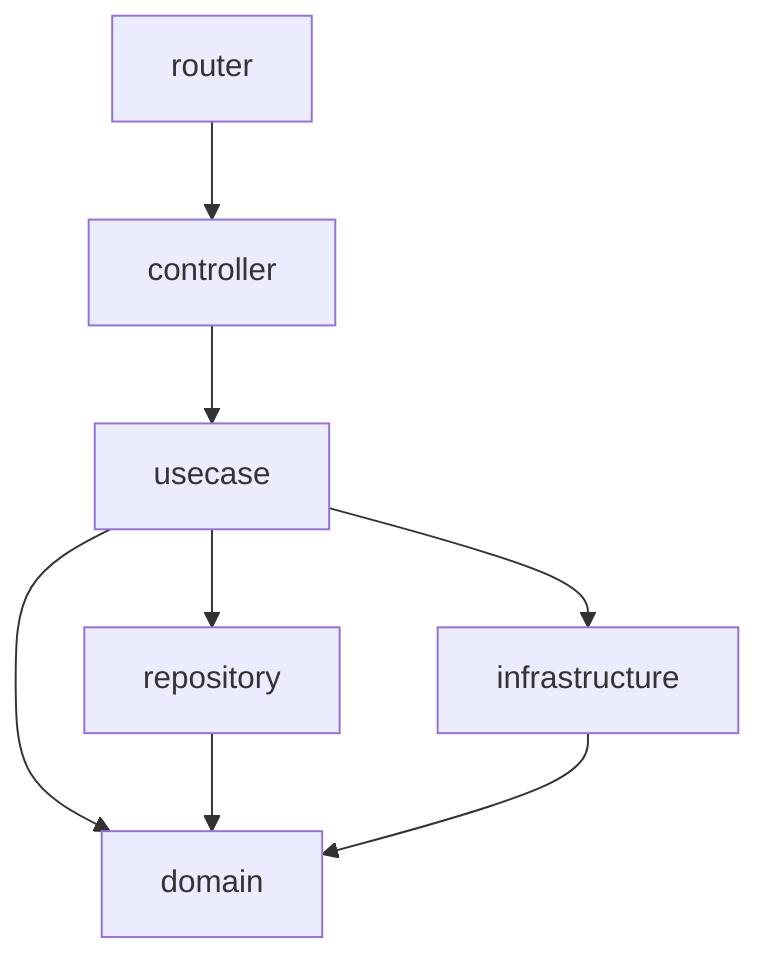
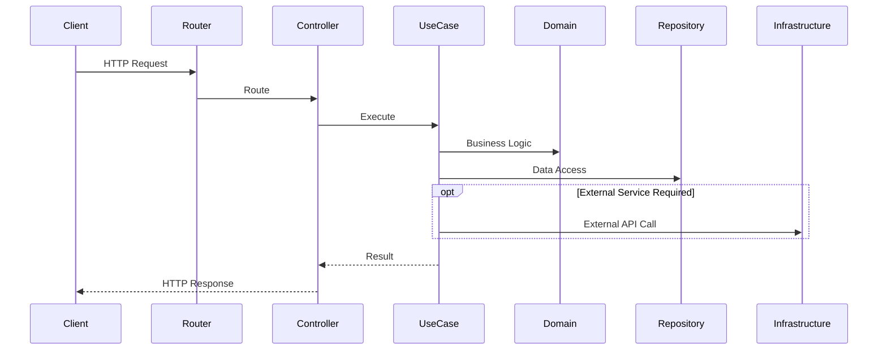

# アーキテクチャ設計

## 層構成と責務

| 層 | 責務 | 配置場所 |
|---|---|---|
| router | APIエンドポイント | api/internal/router/ |
| controller | HTTPリクエストを受け取り、入力変換、レスポンス返却 | api/internal/controller/ |
| usecase | アプリケーション固有の処理フロー | api/internal/usecase/ |
| repository | データの取得・保存などの操作を抽象化 | api/internal/repository/ |
| infrastructure | DB、AI、外部APIなどの具体的な技術実装 | api/internal/infrastructure/ |
| domain | ビジネスルールの核。Entity, ValueObject | api/internal/domain/ |


## 依存関係ルール（許可リスト）

```text
router → controller
controller → usecase
usecase → domain, repository, infrastructure
repository → domain
infrastructure → domain
domain → 何にも依存しない
```

### 補足

* `domain` は他の層に依存しない。
* `usecase` はアプリケーションの処理フローを管理する。
* `repository` はデータ操作を担当し、DomainのEntityを扱う。
* `infrastructure` は外部サービスとの連携を担当する。
* `controller` はHTTPリクエストを受け取り、UseCaseを呼び出す。
* `router` はAPIエンドポイントとControllerを紐付ける。

## infrastructure配下の構成規約

infrastructureは連携先の外部システムごとにサブディレクトリを切り、実装の詳細をカプセル化する。

### DB（PostgreSQL）

| 種別 | 配置場所 | 責務 |
|---|---|---|
| 接続・マイグレーション実行 | api/internal/infrastructure/db/db.go | PostgreSQLへの接続確立とマイグレーションの実行 |
| マイグレーション定義 | api/internal/infrastructure/db/migration/ | PostgreSQL上のテーブル構造(スキーマ)を定義するSQL |
| DBモデル | api/internal/infrastructure/db/model/ | DBの行をGoで扱うための型。domainのEntityとは別物で、repositoryがEntityとの変換を担う |

## DI（Dependency Injection）ルール

各コンポーネントは、必要な依存性を内部で生成してはならない。

依存性は、コンストラクタを通じて外部から注入する。

---

## 依存関係図



---

## 処理フロー



---

## 例外を設ける場合のルール

上記の依存関係ルールに例外が必要な場合は、このファイルに理由とともに追記すること。

無断で依存関係ルールを破った実装は、レビューで差し戻す。

### 例外: controller → infrastructure/auth/supabase

認証(JWT検証)はrouter/controllerに到達する前に行う必要がある横断的関心事であり、
検証結果(UserID)をHTTPリクエストのcontextからcontrollerが取得する
経路が必要になる。usecaseはHTTPやgin.Contextを意識しないため、この受け渡しを
usecase経由にできない。

そのため、`controller`は認証情報の取得(`supabase.FromContext`)に限り
`infrastructure/auth/supabase`に依存してよい。ビジネスロジックやDBアクセスの
ために`infrastructure`の他のパッケージに依存することは引き続き禁止する。

ミドルウェア自体(`supabase.Middleware`)はcomposition root(`cmd/server/main.go`)で
生成し、`gin.HandlerFunc`として`router.New`に渡す。これにより`router`は
`infrastructure`を直接importしない。